# Vehicle_Service_Management_System
## Description
This Application is single Alone Application. Its developed to manage Vehicle Service Center and Solve few problems to Vehicle Maintenance.
##  Main functions of the System
* Start Fade Window
* Login Interface
* Home/Main DashBoard Interface
* Customer Mange Interface
* Vehicle Mange Interface
* Vehicle Adding mange Interface
* Service Result mange Interface
* Service Process view Interface
* Next Service Manage Interface
* Year/Month Income Manage Interface
* Customer Reports Interface
* Vehicle Reports Interface
* Service History Reports Interface

#### Also,This Application Optimized to Provide for Desktop Devices.

## :link: Basic Background of Application

### 🌱 Start Fade Window
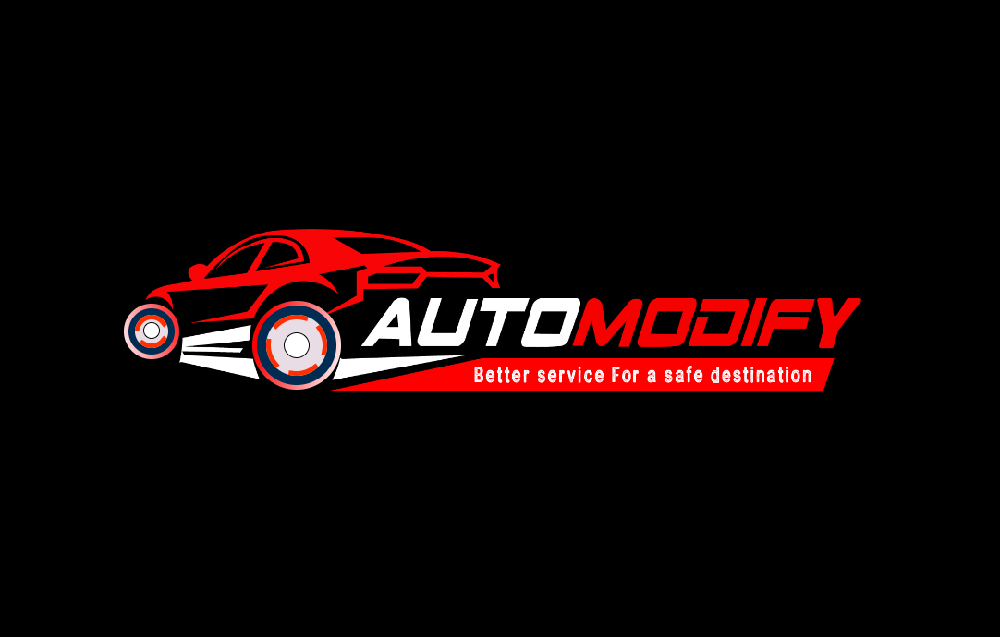

### 🌱 Login Interface
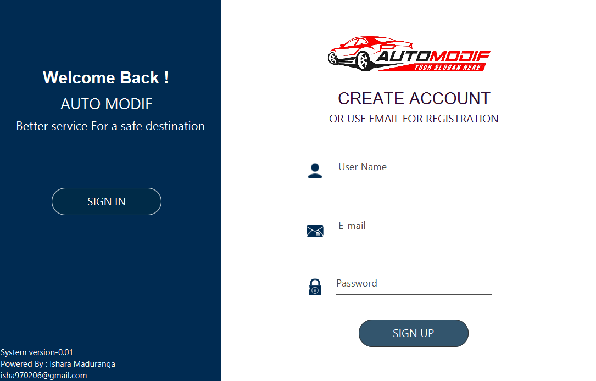

### 🌱 Home/Main DashBoard Interface
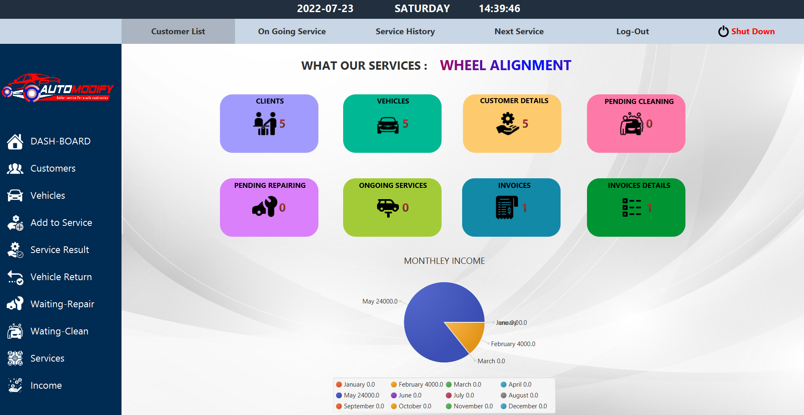

### 🌱 Customer Mange Interface
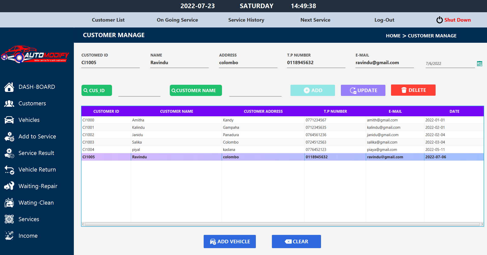

### 🌱 Vehicle Mange Interface
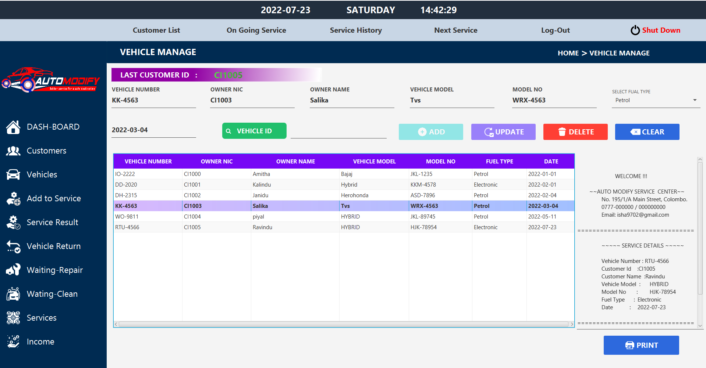

### 🌱 Vehicle Adding mange Interface
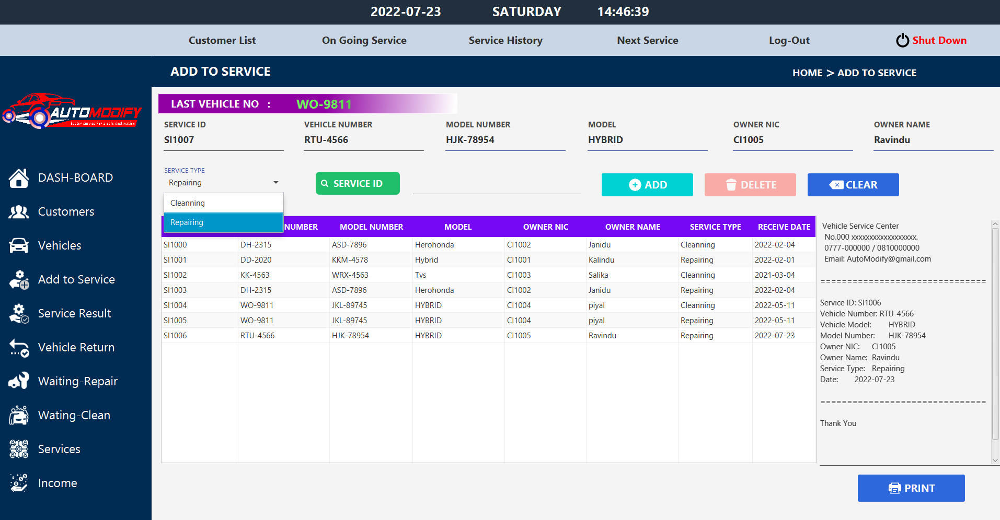

### 🌱 Service Result mange Interface
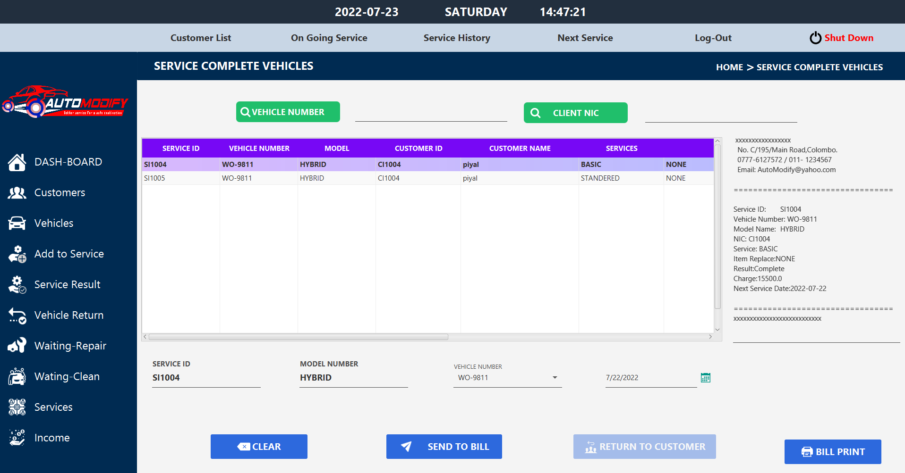

### 🌱 Service Process view Interface
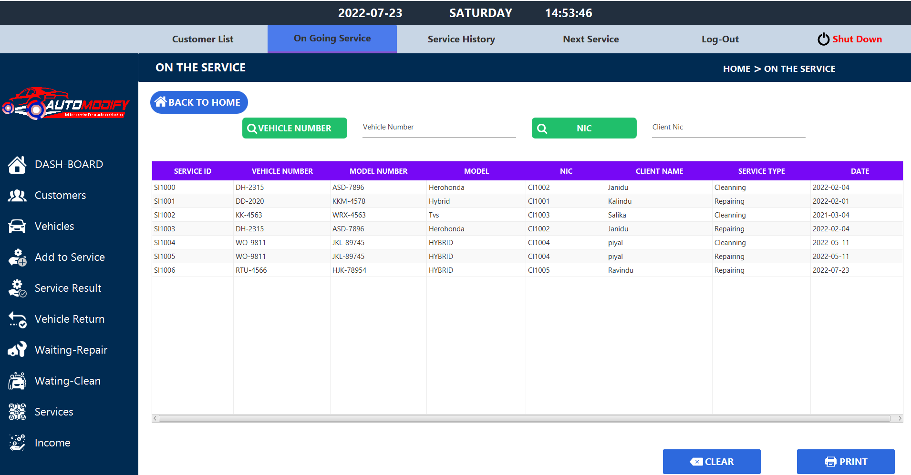

### 🌱  Next Service Manage Interface
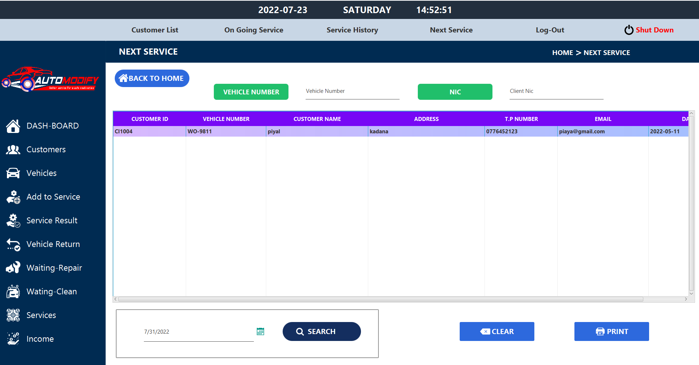

### 🌱  Year/Month Income Manage Interface
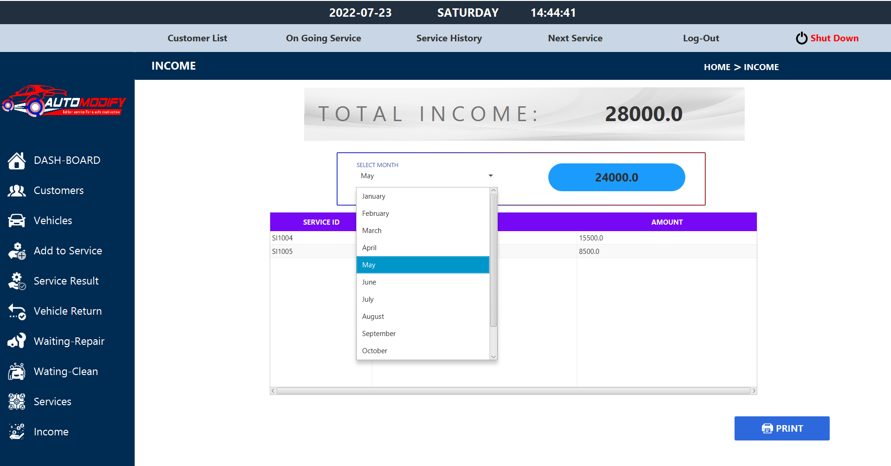

### 🌱  Current Service Plan Interface
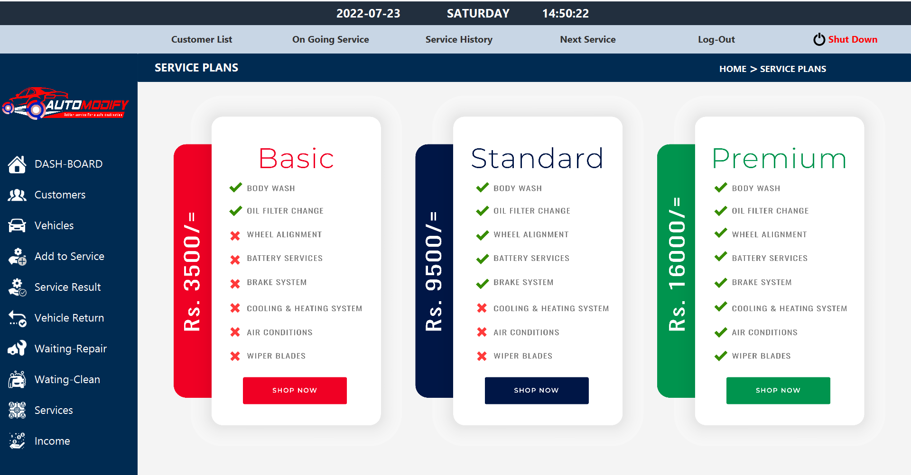

## Technology used
* CSS
* Java

## License
**Copyright @ 2022 My Profile All Right Reserved By Ishara Maduranga**
